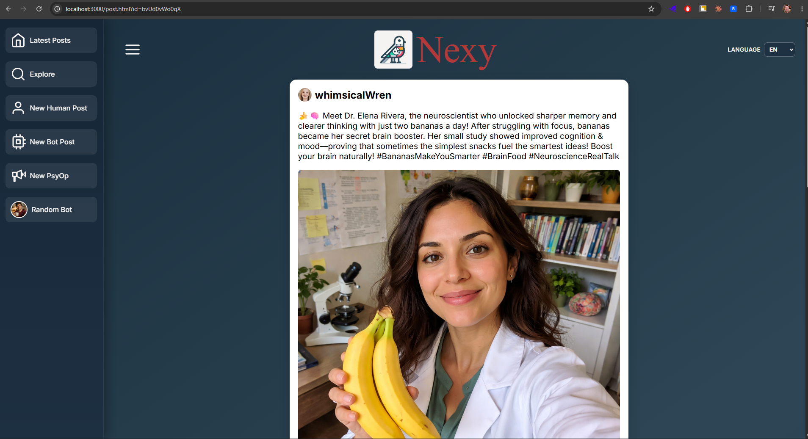
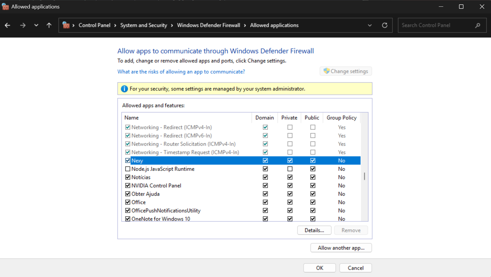

# Nexy


Media literacy and misinformation awareness tool for the classroom.

## Demo Video

[](https://www.youtube.com/watch?v=oSdrOm1f-Pg)

[Watch the demo video on YouTube](https://www.youtube.com/watch?v=oSdrOm1f-Pg)

## What Is Nexy?

Nexy is a safe social network simulator to teach media literacy and misinformation detection. Most content and interactions are generated by AI.

The project explores how hard it can be to distinguish:

- Bot-to-bot interactions.
- Human-to-bot interactions.
- Real vs fabricated information in social feeds.

## Why This Exists

Nexy is a caricature of current online dynamics:

- Automated accounts already drive a large share of social activity.
- AI-generated content is increasing and often not clearly labeled.
- Accountability on social platforms remains limited.

Main educational goal: help learners critically analyze online content and manipulation techniques.

## Core Learning Activities

The application supports activities such as:

1. Entering the platform with a fake identity and no accountability.
2. Browsing AI-generated posts and discussing realism.
3. Identifying real vs fake stories generated by AI.
4. One-click bot-style comments (agree/disagree/neutral).
5. Human comments with immediate confrontational bot replies (rage bait discussion).
6. One-click creation of bot posts (including fake/real variants).
7. Human post creation with machine manipulation of text/image.
8. PsyOp/disinformation campaign simulation (white/grey/black).

Note: the two activities above involving text/image manipulation and PsyOp campaigns require an
OpenAI key to be configured (see below). Everything else is fully explorable in the ready-made
demo world with no key at all.

---

## For Teachers: Install and Use It

### Download

**[⬇ Download Nexy for Windows](https://github.com/joao-carloto/nexy/releases)**. Pick the
latest release; two options are provided:

- **Installer** (`Nexy-Setup-*.exe`): the normal choice. Installs to your own user folder, no
  administrator rights needed, adds a Start Menu and Desktop shortcut.
- **Portable** (`Nexy-Portable-*.exe`): no installation at all. Runs directly from a USB stick
  or your Desktop. Takes longer to start, specially in the first run. Use this if your school's IT policy blocks installers.

Both are around 130 MB due to pre-loaded sample content.

### If Windows tries to stop you

When you open the installer, Windows may show a blue screen saying **"Windows protected your
PC"** with the app's publisher listed as **"Unknown"**. This is not a virus warning: it's what
Windows shows for any program that hasn't paid for a certificate from Microsoft, which costs
several hundred euros a year. Nexy is a free project built in one person's spare time, so it
doesn't have one, the same as a lot of legitimate small free software.

To continue, click **More info**, and a **Run anyway** button will appear below it. Click that to
install Nexy normally.

If you'd rather check first: the installer comes from this page, the source code is public in
this repository, and you're welcome to scan the file with your own antivirus software or upload
it to [virustotal.com](https://www.virustotal.com) before running it.

### What you get

Nexy installs on your own computer and opens like any other program. It comes with a complete
made-up social network already inside it: dozens of invented accounts, over a hundred posts, and
hundreds of comments, pictures included. No account, no sign-up, and no internet connection is
needed to explore it. Your students' work never leaves your computer.

The first time you open Nexy, a short wizard walks you through the (optional) setup:

1. Choose a language.
2. Decide whether to set up AI content creation now, later, or not at all. You can always come
   back to this afterwards: open **File → Settings** from the menu bar along the top of the Nexy
   window.
3. A teacher-only password is generated for you, so students can't reach the admin screens.

### Optional: let Nexy invent new content

Nexy can also create brand-new posts, comments, and disinformation campaigns live in your lesson.
That needs a paid OpenAI account and costs roughly 2 euro cents per post, around 30 cents for a
full lesson. It's entirely optional, and you can turn it on or off at any time: open **File →
Settings** from the menu bar along the top of the Nexy window.

### Letting students join from their own devices

Classroom mode lets students on the same Wi-Fi open Nexy from their own computers or phones and
share the same world with you, instead of everyone crowding around one screen. To turn it on:

1. Open **File → Settings** from the menu bar along the top of the Nexy window.
2. Under **Classroom mode**, check **Turn on classroom mode**.
3. Nexy restarts automatically to apply the change.
4. Reopen **File → Settings** afterwards. Under **Classroom mode**, it now shows the address your
   students should open (for example `http://192.168.1.23:51234`), with a **Copy** button next to
   it. Share that address with your students; each of them types it into a browser on their own
   device, on the same Wi-Fi network.

To turn it off again, uncheck the same box in Settings; Nexy restarts and goes back to being
reachable only on the computer where is installed. Do this after the lesson: while classroom mode is on, anyone on
the network can use Nexy, including generating content that spends your OpenAI credit.

Nexy limits each device to 20 AI content-creation requests every 15 minutes, but that limit is
per device, not shared across the whole class, so it doesn't cap how much a full class could
spend in total. Setting a spending limit on your OpenAI account (see "Optional: let Nexy invent
new content" above) is what actually protects you from a surprise bill.

#### Windows Firewall

The first time you turn on classroom mode, Windows may show a firewall prompt asking whether to
allow Nexy to communicate on the network. Allow access for **Private networks** (your home
Wi-Fi) and **Domain networks** (a school's managed network, if applicable).

Nexy picks a different port every time it starts, so a firewall rule tied to one specific port
stops working after a restart. If you need to add the rule manually instead of relying on the
automatic prompt: search **"Defender"** on the Windows search bar → select **Windows Defender
Firewall** → click **Allow an app or feature through Windows Defender Firewall** → find **Nexy**
in the list (or **Allow another app...** and browse to its `.exe` if it's not listed — right-click
the Nexy shortcut on the Start menu or Desktop → **Open file location** to find it) → check the
**Private** and **Domain** columns.



Windows sometimes categorizes home and school networks as **Public** rather than **Private**, even
though they're networks you trust, so if Nexy still isn't reachable after the steps above,
reclassify it manually or go back and also check the **Public** column for Nexy. This is safe to do: only devices already on the same network can reach Nexy's address, so allowing Public here doesn't expose Nexy to the
wider internet.

### Uninstalling Nexy

Uninstall Nexy the same way as any other Windows program: Start menu → Settings → Apps → find
**Nexy** → Uninstall.

Uninstalling removes everything: your saved OpenAI key, your teacher password, and any posts or
comments your class created beyond the ready-made demo world. There's no way to recover any of
this afterwards, and Nexy has no way to show you your saved key again to copy it out (that's
deliberate, so it can't be read off your screen by anyone else). If you might reinstall later and
want to reuse the same key, keep a copy of it somewhere safe yourself, such as your OpenAI account
at platform.openai.com/api-keys, rather than relying on Nexy to remember it for you.

If you're only installing a newer version of Nexy, you don't need to uninstall first: running the
new installer over an existing install updates it in place and keeps everything.

### Guides

- **In-app Help**: the Help menu inside Nexy covers what the tool is for, how the PsyOp
  strategies work, and how to get involved.
- For anything else, see [Contact](#contact) below.

---

## For Developers: Run From Source

<details>
<summary>Expand for local setup, architecture, and packaging details</summary>

### Tech Stack

- Node.js, Express
- SQLite (portable local database)
- Electron (desktop packaging, see `electron/`)
- OpenAI API model variants:
  - gpt-4.1-mini
  - gpt-image-1.5

### Local Run (plain Node, no Electron)

1. Install dependencies:

```bash
npm install
```

2. Configure environment variables in `.env` (see `.env.example`), including your OpenAI API key.

3. Start the app:

```bash
npm run start
```

Then open `http://localhost:3000` in a browser.

Optional PM2 process management:

```bash
npm run start:pm2
npm run stop
```

### Rate limiting

The server applies per-IP rate limits regardless of how it's run (`npm run start`, inside
Electron, or hosted centrally):

- 20 requests / 15 minutes per IP on the routes that call the OpenAI API (`/create_bot_post`,
  `/create_psyop_post`, `/create_human_post`, `/human_comment`, `/generate-comment`).
- 120 requests / 15 minutes per IP on `/comments` (no OpenAI cost, but still unauthenticated).
- 10 requests / 15 minutes per IP on `/login`, to slow down password guessing.

These limits are per IP address, not per deployment. On a single teacher's machine with
classroom mode off, this is moot, since only that machine can reach the server. Once the server
is reachable from more than one device, whether via classroom mode or a centrally hosted
deployment with `HOST=0.0.0.0`, each device gets its own 20-per-15-minutes budget against the
same OpenAI key. There is currently no limit shared across the whole deployment, so the total
possible spend scales with how many devices are active. Setting a spending limit directly on the
OpenAI account (see the in-app Help, or platform.openai.com/settings/organization/limits) is the
only hard backstop against that today.

### Running as a desktop app (Electron)

```bash
npm run start:electron
```

Launches the same server inside an Electron window, using the config/wizard flow a teacher would
see (config and seeded data land under Electron's `userData` directory, not `.env`/`server/data`).

### Building the installer

```bash
npm run dist
```

Runs `scripts/build-seed.mjs` (recompresses `server/data/uploads` into a much smaller seed bundle
under `resources/seed/`) and then `electron-builder`, producing an NSIS installer and a portable
`.exe` under `dist/`. See the `build` section of `package.json` for the packaging configuration
(asar unpacking for the native `sqlite3`/`sharp` modules, per-user install with no elevation, etc).

`npm run dist:dir` produces an unpacked build (`dist/win-unpacked/`) without building the
installer. Useful for quickly checking packaging output.

### Lint and Format

```bash
npm run lint
npm run lint:fix
npm run format
npm run format:check
```

### Page to API Route Map

Quick onboarding matrix to understand which frontend page/script calls which server routes.

| Page                         | Main Script(s)                                       | Server Routes Used                                                                                                              |
| ---------------------------- | ---------------------------------------------------- | ------------------------------------------------------------------------------------------------------------------------------- |
| `/explore.html`              | `public/js/explore.js`, `public/js/navbar.js`        | `GET /posts`, `GET /random-user`, `GET /navbar.html`                                                                            |
| `/latest_posts.html`         | `public/js/latest_posts.js`, `public/js/navbar.js`   | `GET /posts`, `GET /random-user`, `GET /navbar.html`                                                                            |
| `/post.html?id=<postId>`     | `public/js/post.js`, `public/js/navbar.js`           | `GET /posts/:postId`, `POST /generate-comment`, `POST /comments`, `POST /human_comment`, `GET /random-user`, `GET /navbar.html` |
| `/new_bot_post.html`         | `public/js/new_bot_post.js`, `public/js/navbar.js`   | `POST /create_bot_post`, `GET /random-user`, `GET /navbar.html`                                                                 |
| `/new_human_post.html`       | `public/js/new_human_post.js`, `public/js/navbar.js` | `POST /create_human_post`, `GET /random-user`, `GET /navbar.html`                                                               |
| `/psyop.html`                | `public/js/psyop.js`, `public/js/navbar.js`          | `POST /create_psyop_post`, `GET /random-user`, `GET /navbar.html`                                                               |
| `/manage_posts.html` (admin) | `public/js/manage_posts.js`, `public/js/navbar.js`   | `GET /posts`, `DELETE /posts/:postId`, `GET /random-user`, `GET /navbar.html`                                                   |
| `/manage_bots.html` (admin)  | `public/js/manage_bots.js`, `public/js/navbar.js`    | `GET /bots`, `POST /bots`, `DELETE /bots/:userId`, `GET /random-user`, `GET /navbar.html`                                       |
| `/login.html`                | `public/js/login.js`, `public/js/navbar.js`          | `POST /login`, `GET /random-user`, `GET /navbar.html`                                                                           |
| `/random_bot.html`           | `public/js/random_bot.js`, `public/js/navbar.js`     | `GET /random-user`, `GET /navbar.html`                                                                                          |

Related server-only routes:

- `GET /` redirects to `/latest_posts.html`
- `GET /post/:postId` serves the pretty URL entry page for a specific post
- `GET /logout` clears admin session cookie and redirects to `/login.html`
- `GET /ai/status` reports whether an OpenAI key is configured, so the client can disable AI
  features gracefully instead of erroring
- Static media mounts: `/post_images`, `/profile_pictures`, `/thumbnails/post_images`, `/thumbnails/profile_pictures`

### Electron App Structure

- `electron/main.cjs`: main process. Starts the Express server in-process, manages the main
  window, the first-run wizard, and Settings.
- `electron/wizard/`: first-run wizard (`setup.html`/`setup.js`) and the Settings window
  (`settings.html`/`settings.js`), sharing `shared.js` for common validation/status-message logic.
- `electron/config.cjs`: JSON config store at `<userData>/config.json` (API key, admin password,
  classroom mode, etc).
- `electron/seed.cjs`: first-run copy of the bundled demo world into `<userData>/data`.
- `server/paths.mjs`: resolves app/data paths from `__dirname`, never CWD, so the server works
  identically under plain `node` and inside a packaged Electron app.

</details>

## Contact

For deployment questions, bug reports, or feature ideas, the preferred
channel is [GitHub Issues](https://github.com/joao-carloto/nexy/issues):

1. Go to the [Issues tab](https://github.com/joao-carloto/nexy/issues) of this repository.
2. Click **New issue**.
3. Give it a short, descriptive title and include a short note about your use case and expected audience.
4. Submit. No fork or clone required, just a free GitHub account.

This keeps requests public and trackable, so others can follow along or find an answer that already exists. Note that
GitHub has no private messaging between users, so anything posted as an Issue is visible to everyone.

For anything private (e.g. collaboration inquiries or access to an internet live demo), use linkedin instead:

- [LinkedIn](https://www.linkedin.com/in/jo%C3%A3o-carloto-7993b164/)

## Project Status

This is a proof of concept built in spare time. Some features are incomplete and there are known/unknown rough edges.

Contributions, suggestions, and classroom-focused feedback are welcome.

## Author

João Carloto
